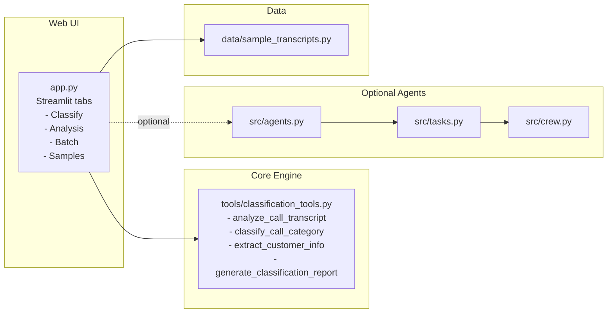
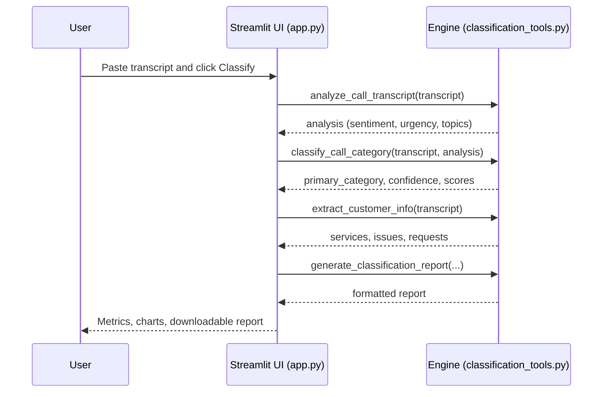
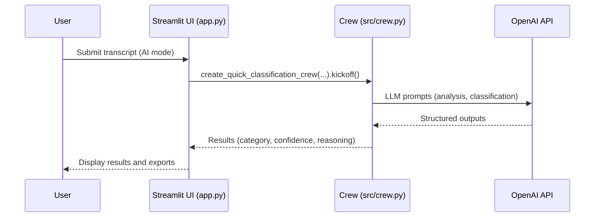

# ABC Telecom Call Analysis — Architecture

This document provides high-level architecture and data flow for the ABC Telecom Call Analysis system. Diagrams use Mermaid and render on GitHub.

## System Context
```mermaid
flowchart TD
  User(End User) -->|Submits transcript / views results| UI[Streamlit Web UI\n(app.py)]

  subgraph Engine[Classification Engine\n(tools/classification_tools.py)]
    A[analyze_call_transcript]
    C[classify_call_category]
    E[extract_customer_info]
    R[generate_classification_report]
  end

  subgraph CrewAI[Optional: Crew AI Orchestration\n(src/agents.py, src/tasks.py, src/crew.py)]
    AG[agents.py]
    TK[tasks.py]
    CW[crew.py]
  end

  OA[(OpenAI API)]
  DATA[(Sample Data\n data/sample_transcripts.py)]

  UI -->|Calls| Engine
  UI -->|Loads samples| DATA
  UI -. optional .-> CrewAI
  CrewAI -. requires .-> OA

  Engine -->|Returns metrics + report| UI
  CrewAI -. returns reasoning .-> UI
```

## Component Overview


## Sequence — Single Call Classification (Direct Path)


## Sequence — Optional Crew AI Path


## Deployment
- Local execution via Streamlit: app runs on localhost:8501
- Source hosted on GitHub: pushes from local repo
- No database; session state in-memory for UI
- Optional: Add CI/CD, Docker, or cloud hosting later

## Key Files
- Web UI: app.py
- Core engine: tools/classification_tools.py
- Optional agents: src/agents.py, src/tasks.py, src/crew.py
- Samples: data/sample_transcripts.py
- Docs: README.md, START_HERE.md, UI_GUIDE.md
